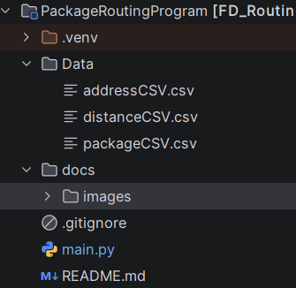
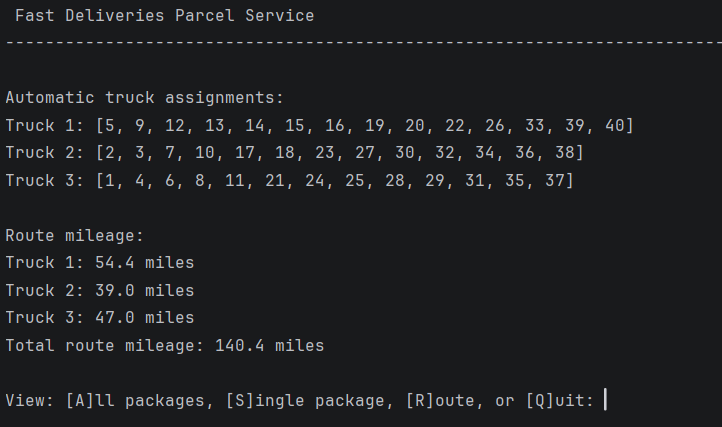
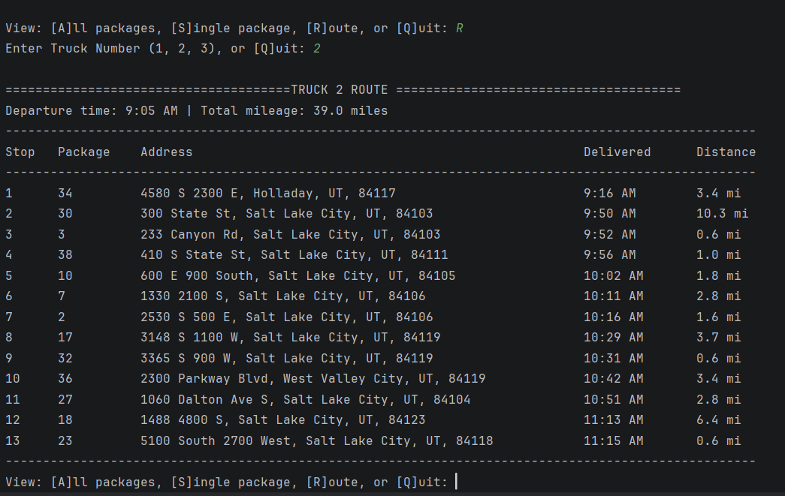
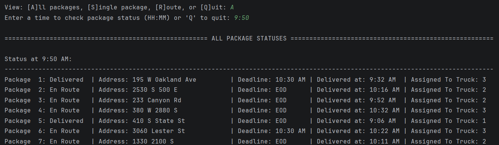

# Package Delivery Routing Simulator

A Python command-line routing simulation that automatically assigns and routes package deliveries while accounting for operational constraints such as truck capacity, delivery deadlines, delayed package availability, truck-specific restrictions, grouped deliveries, and address corrections.

## Overview

This project simulates a small package-delivery operation with three trucks and 40 packages. Package and distance data are loaded from CSV files, packages are stored in a custom chaining hash table, and the program generates delivery routes using a deadline-aware nearest-neighbor approach.

The application allows a user to:

- View the status of all packages at a selected time.
- View the status and delivery details of an individual package.
- View each truck's completed route.
- Review package assignments, delivery order, mileage, delivery time, and distance between stops.

## Features

- Custom chaining hash table for package lookup by package ID.
- CSV-based loading for package, address, and distance data.
- Automatic truck assignment instead of manually hard-coded package lists.
- Detection of truck-specific package restrictions from package notes.
- Detection of delayed package availability times from package notes.
- Automatic grouping of packages that must be delivered together.
- Truck capacity validation.
- Deadline-aware route selection.
- Nearest-neighbor routing used as a distance-based tie-breaker.
- Address-correction handling for packages with corrected delivery information.
- Per-truck route history, mileage tracking, and route display.
- Package-status lookup at user-selected times.

## Routing Approach

The program separates delivery planning into two stages:

1. **Truck assignment**  
   Packages are assigned to trucks using capacity limits, truck-only restrictions, delayed availability, grouped-delivery requirements, and delivery deadlines.

2. **Route selection**  
   Each route is created using a deadline-aware nearest-neighbor heuristic:
   - Packages that can still meet their deadlines are prioritized.
   - Earlier deadlines are selected before later deadlines.
   - When two packages have the same deadline priority, the closest destination is selected.

If no remaining package can meet its deadline, the program selects the closest available package and displays a warning rather than stopping the simulation.

## Technologies

- Python 3
- Standard library modules:
  - `csv`
  - `datetime`
  - `re`

No third-party packages are required.

## Project Structure



## Installation

### Prerequisites

- Python 3.10 or later recommended.
- [PyCharm Community Edition](https://www.jetbrains.com/pycharm/download/) or PyCharm Professional Edition.

### Run with PyCharm

1. Open PyCharm and select **Get from VCS**.
2. Copy the repository URL from GitHub:
   ```text
   https://github.com/jp098/package-routing-program.git
   ```
3. Paste the URL into PyCharm and select **Clone**.
4. When the project opens, configure a Python interpreter if PyCharm does not detect one automatically:
   - Go to **File → Settings → Project: package-delivery-route-optimizer → Python Interpreter**.
   - Select **Add Interpreter**.
   - Choose **Add Local Interpreter → Virtualenv → New**.
   - Use the project folder as the location for the virtual environment, usually:
     ```text
     package-routing-program/.venv
     ```
   - Choose an installed Python 3 interpreter as the base interpreter.
5. Open `main.py`.
6. Right-click anywhere in `main.py` and select **Run 'main'**.

## Example Usage

When the application starts, it displays automatic truck assignments and route mileage.



The menu supports package-status and route views:

- Enter `A` to view all package statuses at a selected time.
- Enter `S` to view one package by package ID.
- Enter `R` to display a truck's full route, including delivery order, package IDs, destinations, delivery times, and distance from the prior stop.
- Enter `Q` to exit the program.

## Example Route Output



## Example Package Status Output



## Design Notes

This project began as a nearest-neighbor delivery-routing implementation. It was expanded to address realistic delivery constraints and to make the decision process more transparent.

Key improvements included:

- Replacing manually assigned package lists with CSV-driven assignment logic.
- Parsing restrictions and availability conditions from package notes.
- Modeling delivery groups as connected package relationships.
- Prioritizing delivery deadlines during route selection.
- Adding warnings for deliveries that cannot be completed before their deadline.
- Recording route history for each truck so completed routes can be reviewed.

## Limitations and Future Improvements

The current implementation is a heuristic simulation rather than a globally optimal vehicle-routing solver. Potential future enhancements include:

- Geographic clustering during truck assignment.
- More advanced route optimization using time-window feasibility scoring.
- A graphical map or web-based interface.
- Automated unit tests for package restrictions, group assignments, deadlines, and route results.
- Return-to-hub mileage calculations.
- CSV export of route summaries and delivery reports.

## Author

Jair Palacios